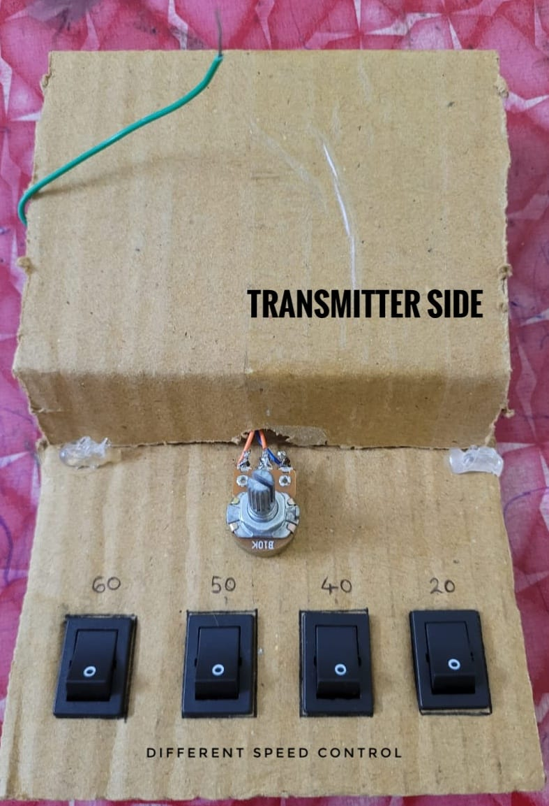

# Adaptive-Speed-Controller
We have built a prototype of a system that controls the speed of a vehicle automatically when the vehicle enters a speed restriction zone.
## Features
- Wireless control of vehicle speed
- Real-time LCD and audio feedback
- Simple and practical Arduino-based implementation

## How It Works
The system uses a wireless transmitter to send control signals to a receiver, which processes them and adjusts the motor speed accordingly. The LCD displays system status and a speaker provides sound feedback. It demonstrates the concept of adaptive speed control using basic embedded systems.

## How to Use
1. Upload the `ArduinoCode` to the Arduino Nano.
2. Connect all components based on the provided circuit diagrams.
3. Power the system using a 7.4V battery.
4. Operate the transmitter to control speed.
5. Observe real-time output on the display and motor behavior.

## Files in This Repository
- `ArduinoCode` – Arduino code for receiver side
- `block diagram.png` – Overall system block diagram
- `receiver circuit.png` – Circuit diagram for receiver module
- `receiver side.jpg` – Image of the receiver hardware setup
- `transmitter circuit.png` – Circuit diagram for transmitter module
- `transmitter.jpg` – Image of the transmitter hardware setup
- `working (2).mp4` – Video demonstration of the working project

## Preview

### Block Diagram

### Circuit Diagrams
**Receiver Side:**  

**Transmitter Side:**  

###  Hardware Images
**Receiver Setup:**  

**Transmitter Setup:**  

### 🎥 Demo Video
[▶️ Click to watch](./working%20(2).mp4)

## Authors
Made by Anna Retchi, Bestin Alias, Arthur Jacob, Antony Roony PX
